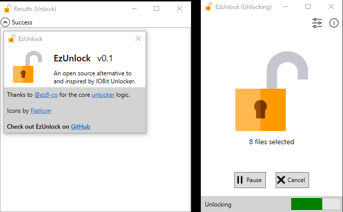

# EzUnlock

> An open source alternative to and inspired by IOBit Unlocker

EzUnlock is a simple GUI application for deleting *stuck* / *stale* / *undeletable* files.
It uses [`@ez8-co`](https://github.com/ez8-co)'s **unlocker** library under the hood.

# Building

I use **VS 2022** for development. Simply build the solution `EzUnlock.sln` and the output files will get copied to `dist\` folder.

# Contributing

Check [TODO](https://github.com/demberto/EzUnlock/blob/master/TODO.md)

# Thanks

Unlocker: [@ez8-co/unlocker](https://github.com/ez8-co/unlocker)

Icons by: [FlatIcon](https://flaticon.com)

# License

**EzUnlock** is licensed under the [MIT License](https://github.com/demberto/EzUnlock/blob/master/LICENSE)
